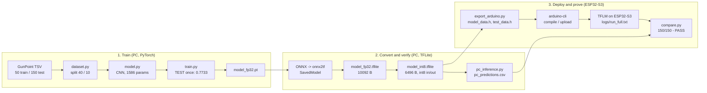
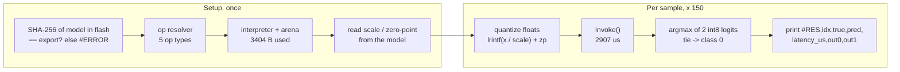

# edge32_gunpoint

A small, verified TinyML pipeline: the UCR GunPoint time-series dataset, a 1586-parameter
1-D CNN in PyTorch, conversion to an 8-bit TensorFlow Lite model, and deployment with
TensorFlow Lite Micro on an ESP32-S3. The deployment is proven, not assumed: all 150 samples
of the official test split are run on the PC and on the board and compared sample by sample,
including the raw 8-bit outputs.

## Results

| stage                          | accuracy (TEST, 150 samples) |
|--------------------------------|------------------------------|
| PyTorch FP32                   | 0.7733                       |
| TFLite FP32 (PC)               | 0.7733                       |
| TFLite INT8 (PC, ref. kernels) | 0.7733                       |
| TFLite INT8 (ESP32-S3)         | 0.7733                       |

Board vs PC (INT8): 150/150 identical predictions, 150/150 identical raw int8 logits.
Model file 6496 bytes; tensor arena used 3404 bytes; Invoke() latency mean 2907 us
(min 2812, max 2928) at 240 MHz; firmware 443169 bytes of flash (33 % of the 1.2 MB app
partition, including the 150 test samples), 56552 bytes of static RAM.

The accuracy itself is modest; the training split has 50 rows and no tuning was done. The
purpose of the project is the correctness of the path from PyTorch to the microcontroller.

## Architecture: from the dataset to the ESP32-S3

Three columns, left to right: train on the PC, convert and verify on the PC, deploy and prove on the board. Every box is one script or one artifact of this repository; every number was measured.

### What happens on the ESP32-S3

The board never sees Python, PyTorch or TensorFlow. It holds two byte arrays compiled into
its firmware (the 6496-byte `.tflite` model and the test samples) and the TensorFlow Lite
Micro runtime from the Chirale_TensorFLowLite 2.0.0 Arduino library.

Because the input quantization on the board uses the same formula and rounding rule as
the PC (`lrintf` / `np.rint`, both round-half-to-even) and the model bytes are proven
identical by the SHA-256, the only thing left that could differ is the kernel arithmetic -
and that is exactly what the raw-logit comparison measures.

### Stage-by-stage summary

| stage | script / artifact | key measured fact |
|-------|-------------------|-------------------|
| data | `src/dataset.py` | 50 / 150 rows, length 150, per-series std 0.996661 everywhere: no preprocessing |
| model | `src/model.py` | 1586 parameters, Linear input 16 x 36 = 576 |
| training | `src/train.py` | early stop epoch 97, best epoch 77, TEST 0.7733 (once) |
| FP32 conversion | `src/convert_tflite.py` | 10092 bytes, max abs diff vs PyTorch 2.9e-06, 150/150 agree |
| INT8 quantization | `src/convert_tflite.py` | 6496 bytes, in 0.017343521/9, out 0.041003779/8, accuracy 0.7733 |
| PC reference | `src/pc_inference.py` | 150 rows of raw int8 logits, reference kernels |
| export | `src/export_arduino.py` | SHA-256 a0614175...5631 |
| firmware | `firmware/gunpoint_tflm/` | arena 3404 B, 2907 us/inference, 443169 B flash, 56552 B RAM |
| proof | `src/compare.py` | 150/150 predictions, 150/150 raw logits, 7/7 integrity checks |

`src/inspect_tflite.py` prints the operators, tensor shapes, dtypes and quantization
parameters of any `.tflite` file.

## Dataset

GunPoint from the UCR Time Series Classification Archive: one female and one male actor
either drawing a replica gun from a holster or just pointing; the series is the x-position
of the right hand, 150 samples long. Donated by Ratanamahatana and Keogh (SIAM SDM 2004);
see `data/GunPoint/README.md` and http://www.timeseriesclassification.com/description.php?Dataset=GunPoint

## Requirements

- Windows 11, Python 3.12 (`requirements.txt` pins the versions that were used)
- arduino-cli 1.5.1 (the copy bundled with Arduino IDE 2.x), arduino-esp32 core 3.3.11
- Arduino library Chirale_TensorFLowLite 2.0.0
- ESP32-S3 board (here: PandaByte xS3, FQBN `esp32:esp32:pandabyte_xs3:CDCOnBoot=default`, COM11)

## How to run

All Python scripts are run from the project root as modules.

    python -m venv .venv
    .\.venv\Scripts\Activate.ps1
    pip install -r requirements.txt

    python -m src.dataset
    python -m src.model
    python -m src.train
    python -m src.convert_tflite
    python -m src.inspect_tflite models/model_int8.tflite
    python -m src.pc_inference
    python -m src.export_arduino            # first 5 test samples; --all for all 150

    arduino-cli compile --jobs 1 --fqbn esp32:esp32:pandabyte_xs3:CDCOnBoot=default firmware\gunpoint_tflm | Tee-Object -FilePath results\compile_summary.txt
    arduino-cli upload  --fqbn esp32:esp32:pandabyte_xs3:CDCOnBoot=default -p COM11 firmware\gunpoint_tflm
    cmd /c "(ping -n 4 127.0.0.1 >nul & echo. & ping -n 11 127.0.0.1 >nul) | arduino-cli monitor -p COM11 -c baudrate=115200 > logs\run_full.txt 2>&1"

    python -m src.compare logs/run_full.txt

The capture command connects, waits 3 s, sends ENTER (the sketch prints a complete report on
any received byte) and records for 10 s. See TUTORIAL.md, Step 8, for why this is necessary
on the ESP32-S3's native USB-Serial/JTAG port.

## Files

    config.py             every setting (paths, seed, split, model sizes, training, serial)
    src/                  the pipeline, one script per stage
    models/               model_fp32.pt, model.onnx, saved_model/, model_fp32.tflite, model_int8.tflite
    firmware/gunpoint_tflm/  sketch, board_config.h, generated model_data.h and test_data.h
    logs/                 raw serial captures (never edited)
    results/              every measured number: data_stats.json, train_metrics.json,
                          pc_predictions.csv, pc_summary.json, export_manifest.json,
                          compile_summary.txt, summary.txt
    TUTORIAL.md           step-by-step explanation with the measured numbers

## Two findings worth knowing before reusing this

1. Chirale_TensorFLowLite 2.0.0 applies a single weight scale per FULLY_CONNECTED layer, but
   TensorFlow 2.21 quantizes dense layers per output channel by default. The result is a
   silently mis-scaled second output channel on the board (predictions still looked right).
   Fix: `converter._experimental_disable_per_channel_quantization_for_dense_layers = True`.
2. The PC's `tf.lite.Interpreter` uses the XNNPACK delegate by default, which can differ from
   TFLite's reference int8 kernels by one 8-bit step on rounding boundaries (one sample here).
   The board matches the reference kernels, so the PC reference is built with
   `experimental_op_resolver_type=BUILTIN_REF`.

Both were found only because raw int8 outputs were compared, not just predictions.